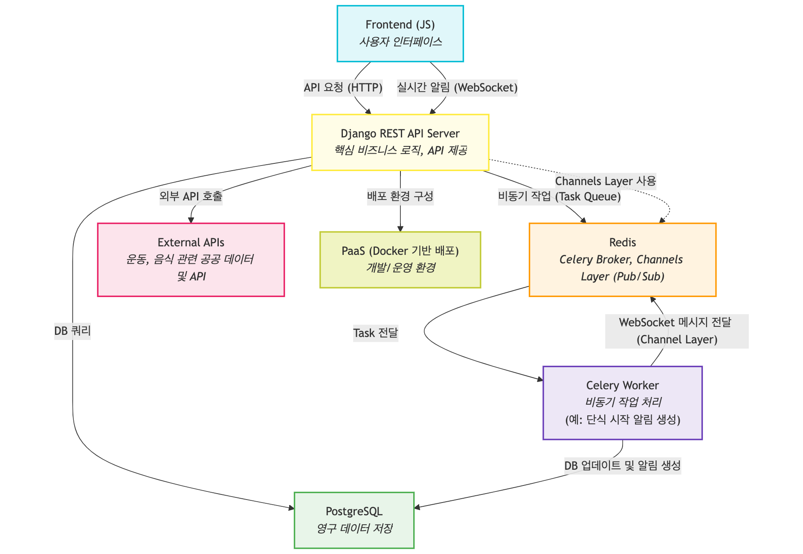
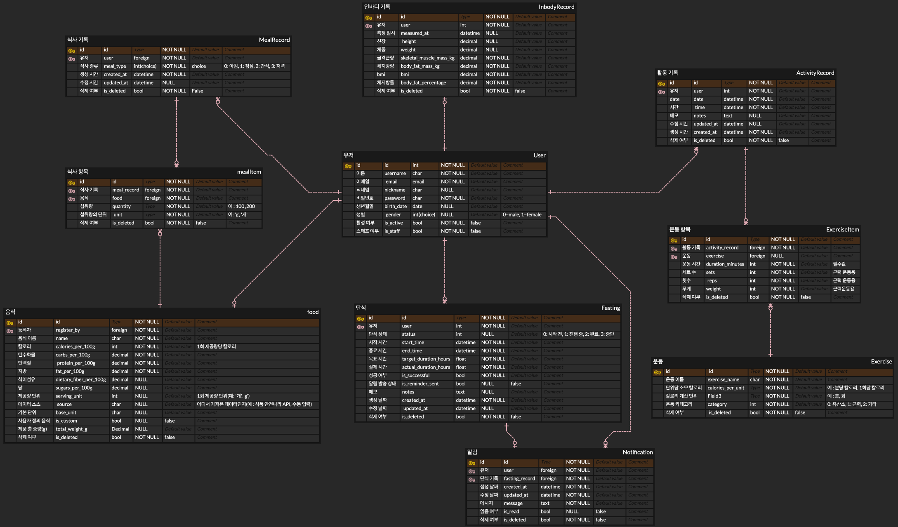

<br>

# BodySync
내 몸의 상태를 관리하고 기록하며, 삶과 건강의 조합(Sync)을 이루는 날까지 BodySync와 함께!
<br>
<br>

---

<br>

## 목차

- [프로젝트 소개](#프로젝트-소개)
- [주요 기능](#주요-기능)
- [기술 스택](#기술-스택)
- [프로젝트 아키텍처](#프로젝트-아키텍처)
- [백엔드 API](#백엔드-api)
- [데이터베이스 ERD](#데이터베이스-erd)
- [프론트엔드 저장소](#프론트엔드-저장소)
- [프로젝트 주요 구성](#프로젝트-주요-구성)
- [배포 환경](#배포-환경)
- [환경 변수 설정](#환경-변수-설정)
- [설치 및 실행](#설치-및-실행)
- [데이터 임포트 및 초기화](#데이터-임포트-및-초기화)

<br>
<br>

---
<br>

# 프로젝트 소개

BodySync는 사용자가 운동, 식단, 단식, 인바디 건강과 관련된 데이터를 기록하고 효율적으로 관리할 수 있는 웹 애플리케이션입니다.  
Django DRF와 Javascript를 활용하여 구성되었으며, Docker 기반의 일관된 개발 및 배포 환경을 구축했습니다.  
비동기 작업 및 JWT 기반 인증 보안 등 기술을 적용하여 높은 신뢰성과 확장성을 확보했습니다.  
공공데이터와 식약처 외부 API를 연동해 신뢰도 높은 데이터를 기반으로 건강 데이터를 편리하게 기록하고 조회하는 기능을 제공합니다.
<br>
<br>

---

<br>

# 주요 기능

- 공공데이터 및 식약처 API를 통한 정확한 운동·영양 데이터 연동 기록 및 조회
- OAuth2, JWT 기반 안전한 사용자 인증 및 소셜 로그인
- 운동 및 식단 기록, 단식 관리, 인바디 데이터 이력 관리 및 조회
- 직관적인 건강 데이터 조회 및 시각화를 위한 UI/UX 제공
- 비동기 실시간 알림 시스템 (Celery, Redis 활용)
- Docker, PaaS 환경을 통한 배포 및 자동화
<br>
<br>

---

<br>

# 기술 스택

- Python, Django, Django REST Framework  
- javascript (프론트엔드)  
- PostgreSQL  
- Redis, Celery (비동기 작업 처리)  
- Docker, PaaS
- OAuth2, JWT (인증 및 보안)
<br>
<br>

---

<br>

# 프로젝트 아키텍처

<br>
<br>

---

<br>

# 백엔드 API
* [API 문서](https://www.notion.so/21188b9340448080a4b4e5dbe664ed0c?source=copy_link)
* [Swagger](https://api.body-sync.shop/api/schema/swagger-ui/#/)
<br>
<br>

---

<br>

# 데이터베이스 ERD

</p>
<br>
<br>

---

<br>

# 프론트엔드 저장소
[BodySync Frontend](https://github.com/Eunnylog/BodySync_Front.git)
<br>
<br>

---

<br>

# 프로젝트 주요 구성
각 애플리케이션의 주요 역할은 다음과 같습니다.

- **`user`**: 사용자 인증, 회원 가입 및 정보 관리, OAuth2 소셜 로그인(구글, 카카오) 등 사용자 관련 핵심 로직 담당합니다. **HTTP-Only JWT 기반 쿠키 인증을 통해 안전하게 토큰을 관리**합니다.
- **`meal`**: 식단 기록 및 관리, 음식 검색 (DB 및 API 연동), 식단과 음식 별 영양성분 정보를 제공합니다. **공공데이터는 운영자만 수정 및 삭제가 가능**하며 **회원들이 직접 생성한 항목은 본인에 한해 수정 및 삭제가 가능**합니다.
- **`activity`**: 운동 검색(DB 연동)을 통해 운동 기록을 할 수 있으며 시간 및 소모칼로리, 운동 카테고리를 확인할 수 있습니다. **운동 데이터는 전문적이다보니 운영자만 등록 및 수정 삭제를 할 수 있도록 설계**했습니다.
- **`inbody`**: 인바디 측정 결과 기록 및 **시각화**, 체성분 변화 추이 분석 등 건강 데이터를 다룹니다.
- **`fasting`**: 단식 시작/종료 기록, 단식 관리, 목표 설정 등 단식 관리 핵심 기능을 제공하며 체중 관리를 돕습니다. 시작 시간을 예약하면 알람이 1회 발송됩니다.
- **`notification`**: **실시간 알림 시스템 구축**하여 사용자에게 중요한 정보를 전달하는 기능을 담당합니다. **Celery와 Redis를 활용하여 비동기적으로 알림 처리(예: 예약 단식 발송)**하며 **웹소켓을 통해 예약된 단식 기록 알림을 사용자에게 즉각적으로 푸시**합니다. 현재는 시작 시간이 예약된 단식 기록에 한하여 알림 1회 발송 기능을 제공합니다.
<br>
<br>

---

<br>

# 배포 환경
Bodysync는 효율적인 개발/배포 워크플로우를 위해 클라우드 PaaS를 활용하고 있습니다.

*   **프론트엔드 (Frontend)**: **Netlify**를 통해 배포되어 정적 파일 서빙 및 CDN 이점을 활용합니다.
*   **백엔드 (Backend)**: **Render**에서 Docker 컨테이너 기반으로 배포 및 운영됩니다.
<br>
<br>

---

<br>

# 환경 변수 설정

Bodysync를 정상적으로 실행하기 위해서는 다음과 같은 환경 변수들이 필요합니다. `.env` 파일을 프로젝트 루트에 생성하고 값을 채워주세요.

| 변수명                 | 설명                                                    | 발급처/정보                                      | 필수 여부   |
|----------------------|-------------------------------------------------------|------------------------------------------------|-----------|
| `SECRET_KEY`         | Django 프로젝트 시크릿 키                               | 고유한 값으로 생성                                | 필수      |
| `DEBUG`              | 디버그 모드 활성화 (개발 시 `True`)                     | `True` 또는 `False`                            | 필수      |
| `ALLOWED_HOSTS`      | 서비스 허용 호스트 (콤마로 구분)                      | `127.0.0.1,localhost,api.body-sync.shop,body-sync.shop` | 필수      |
| `REDIS_URL`          | Redis 서버 연결 URL                                   | `redis://localhost:6379/0` (Docker 사용 시 `redis://redis:6379/0`) | 필수      |
| `POSTGRES_DB`        | PostgreSQL 데이터베이스 이름                            | 사용자 설정                                       | 필수      |
| `POSTGRES_USER`      | PostgreSQL 사용자 이름                                  | 사용자 설정                                       | 필수      |
| `POSTGRES_PASSWORD`  | PostgreSQL 비밀번호                                     | 사용자 설정                                       | 필수      |
| `GOOGLE_CLIENT_ID`   | 구글 OAuth2 클라이언트 ID                               | [Google Cloud Console](https://console.cloud.google.com/) | 선택 (소셜 로그인 사용 시) |
| `GOOGLE_SECRET_KEY`  | 구글 OAuth2 클라이언트 시크릿 키                        | [Google Cloud Console](https://console.cloud.google.com/) | 선택 (소셜 로그인 사용 시) |
| `KAKAO_CLIENT_ID`    | 카카오 OAuth2 클라이언트 ID                             | [Kakao Developers](https://developers.kakao.com/) | 선택 (소셜 로그인 사용 시) |
| `KAKAO_SECRET_KEY`   | 카카오 OAuth2 클라이언트 시크릿 키                      | [Kakao Developers](https://developers.kakao.com/) | 선택 (소셜 로그인 사용 시) |
| `FOOD_API_KEY`       | 식품영양성분 데이터 공공 API 키                       | [공공데이터포털](https://www.data.go.kr/data/15127578/openapi.do) -> API 활용신청 후 발급 | 필수 (음식 데이터 임포트 시) |

---
<br>

# 설치 및 실행

```bash
# 저장소 클론
git clone https://github.com/Eunnylog/BodySync.git
cd BodySync

# Docker 컴포즈로 의존성 컨테이너 구동
docker-compose up -d

# Django 마이그레이션 및 초기화
docker-compose exec web python manage.py migrate
docker-compose exec web python manage.py createsuperuser

# 서버 접속
http://localhost:8000
```
<br>
<br>

---

<br>

# 데이터 임포트 및 초기화

서비스에 필요한 초기 데이터를 데이터베이스에 적재하는 단계입니다. 데이터를 임포트하기 전, 필요한 파일들을 다운로드하고 프로젝트의 `data/` 디렉토리에 위치시켜야 합니다.
<br>

## 1. 운동 데이터 임포트

* **용도**: 서비스에서 제공하는 운동 검색 기능의 **기본 데이터베이스를 구축**하는 데 사용됩니다.
*   **파일 소스**: [공공데이터 포털](https://www.data.go.kr/data/15068730/fileData.do) `'한국건강중진개발원_보건소 모바일 헬스케어 운동'` 게시글의 `csv` 파일을 다운로드합니다.
* **데이터 특이사상 및 가공 가이드라인**: 
    * 원본 CSV에는 `헤더가 없는 상태이며` `운동명(exercise_name)`과 `단위 체중당 소비 칼로리(calories_per_unit)` 두 개의 데이터만 포함되어 있습니다.
    * 본 프로젝트에서는 운동 데이터의 정확한 활용을 위해 원본 CSV 파일을 다음 가이드라인에 따라 **수동으로 가공**해야합니다.
    * **헤더추가**: CSV **맨 윗줄(첫 번째 행)** 에 다음 컬럼명들을 추가합니다: `exercise_name,calories_per_unit,base_unit,category`
    * **값 입력 규칙**:
        * **`base_unit`**: 모든 운동 데이터에 대해 `1`을 입력합니다.
        * **`category`**: 운동 분류에 따라 다음 값을 입력합니다.
            * 유산소 운동: `0`
            * 근력 운동: `1`
            * 기타 운동: `2`
*   **파일 위치**: 위 강드라인에 따라 보완한 CSV 파일을 프로젝트 루트 디렉토리 아래의 `data/` 디렉토리에 `exercise.csv` 파일명으로 위치시켜야 합니다. (예: `your_project_root/data/exercise.csv`)
*   **실행 명령어**: Docker 환경에서 다음 명령어를 실행하여 운동 데이터를 DB에 임포트합니다.
    ```bash
    docker-compose exec web python manage.py import_exercise data/exercise.csv
    ```
    *   **주의**: 
        * 위 명령어에서 `'data/exercise.csv'`는 프로젝트 내 상대 경로입니다. 실제 파일이 `data/` 디렉토리에 정확히 위치하는지 확인 후 경로를 조정해 주세요.
        * CSV 헤더 보완 및 값 입력 가이드를 정확히 따라야 운동 데이터가 서비스에 올바르게 반영되며 가공이 제대로 되지 않으면 데이터 오류가 발생할 수 있습니다.
<br>

## 2. 음식 영양성분 초기 데이터 임포트 (엑셀 파일)

*   **용도**: 서비스에서 제공하는 음식 검색 기능의 **기본 데이터베이스를 구축**하는 데 사용됩니다.
*   **파일 소스**: [식품안전나라 영양성분 데이터베이스](https://various.foodsafetykorea.go.kr/nutrient/)에서 '영양성분 DB 다운 받기' 이동하여 `'음식 DB'(8.59MB) 파일`을 다운로드합니다.
*   **파일 위치**: 다운로드한 엑셀 파일(`food_db.xlsx` 등)을 프로젝트 루트 디렉토리 아래의 `data/` 디렉토리에 위치시켜야 합니다. (예: `your_project_root/data/food_db.xlsx`)
*   **실행 명령어**: Docker 환경에서 다음 명령어를 실행하여 음식 영양성분 데이터를 DB에 임포트합니다.
    ```bash
    docker-compose exec web python manage.py import_foods_from_excel data/food_db.xlsx --sheet_name "20250408_음식DB 14,584건(134종)"
    ```
    *   **주의**: 위 명령어에서 `'data/food_db.xlsx'` 경로와 `--sheet_name`은 실제로 다운로드한 엑셀 파일명 및 해당 시트 이름과 **정확히 일치**시켜야 합니다. 엑셀 파일명과 시트 이름이 다를 경우 명령어가 실패할 수 있습니다.
    *   **이 임포트 과정에는 `FOOD_API_KEY`가 필요하지 않습니다.**
<br>

## 3. (런타임 시) 음식 검색 API 활용

*   **용도**: `FOOD_API_KEY` 환경 변수가 설정되어 있는 경우, 서비스 실행 중에 사용자가 DB에 존재하지 않는 음식을 검색할 때 **공공데이터포털 API를 동적으로 호출**하여 최신 데이터를 가져옵니다.
*   **파일 소스**: [공공데이터 포털](https://www.data.go.kr/data/15127578/openapi.do#/API%20%EB%AA%A9%EB%A1%9D/getFoodNtrCpntDbInq02) 
*   가져온 API 데이터는 DB에 저장되어 다음 검색 시 활용됩니다.
*   **`FOOD_API_KEY`는 초기 데이터 임포트에는 사용되지 않으며, 서비스 운영 중 API를 통한 실시간 데이터 확보에 활용됩니다.**


---
